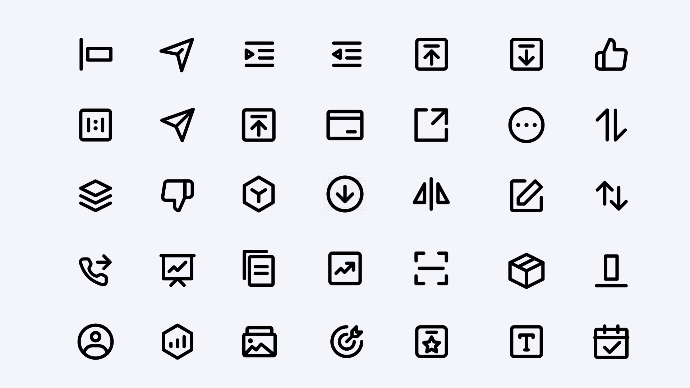

# Icon Awesome
Collection of free icon websites

## SVG Icon
- [Icônes](https://icones.js.org/)
- [ByteDance IconPack](https://iconpark.oceanengine.com/official)
- [HeroIcons Beautiful hand-crafted SVG icons](https://heroicons.com/)
- [Feather Icon](https://feathericons.com/)
- [iconify](https://github.com/iconify/iconify)
- [Supercons](https://github.com/lachlanjc/supercons)
- [IconScout](https://iconscout.com/icons)

## React Icon Package
- [Ant Design Icon](https://ant.design/components/icon/) by AntFinance (297 icons)
- [Evil Icons](https://evil-icons.io/) by Alexander Madyankin & Roman Shamin (v1.10.1, 70 icons)
- [FontAwesome](http://fortawesome.github.io/Font-Awesome/icons/) by Dave Gandy (v4.7.0, 675 icons)
- [FontAwesome 5](https://fontawesome.com/) by Fonticons, Inc. (v5.13.0, 1588 (free) 7842 (pro) icons)
- [Fontisto](https://github.com/kenangundogan/fontisto) by Kenan Gündoğan (v3.0.4, 615 icons)
- [Foundation](http://zurb.com/playground/foundation-icon-fonts-3) by ZURB, Inc. (v3.0, 283 icons)
- [Ionicons](https://ionicons.com/) by Iconic Framework (v5.0.1, 1227 icons)
- [MaterialIcons](https://www.google.com/design/icons/) by Google, Inc. (v4.0.0, 1547 icons)
- [MaterialCommunityIcons](https://materialdesignicons.com/) by MaterialDesignIcons.com (v5.3.45, 5346 icons)
- [Octicons](http://octicons.github.com/) by Github, Inc. (v8.4.1, 184 icons)
- [Zocial](http://zocial.smcllns.com/) by Sam Collins (v1.0, 100 icons)
- [SimpleLineIcons](https://simplelineicons.github.io/) by Sabbir & Contributors (v2.4.1, 189 icons)
- [React Icons](https://github.com/react-icons/react-icons)

